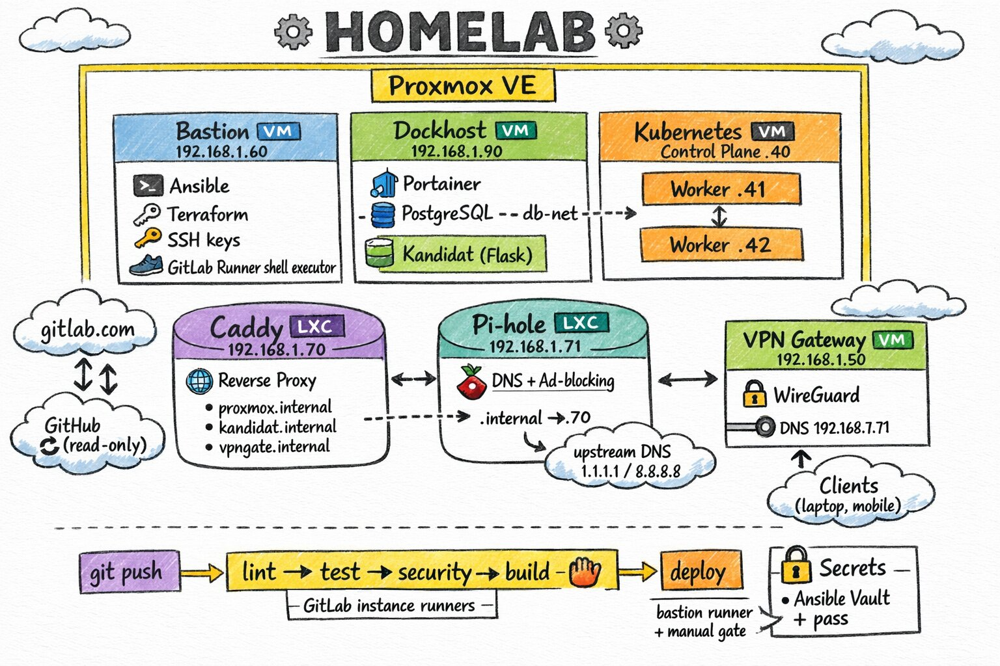

```
 ██╗  ██╗ ██████╗ ███╗   ███╗███████╗██╗      █████╗ ██████╗
 ██║  ██║██╔═══██╗████╗ ████║██╔════╝██║     ██╔══██╗██╔══██╗
 ███████║██║   ██║██╔████╔██║█████╗  ██║     ███████║██████╔╝
 ██╔══██║██║   ██║██║╚██╔╝██║██╔══╝  ██║     ██╔══██║██╔══██╗
 ██║  ██║╚██████╔╝██║ ╚═╝ ██║███████╗███████╗██║  ██║██████╔╝
 ╚═╝  ╚═╝ ╚═════╝ ╚═╝     ╚═╝╚══════╝╚══════╝╚═╝  ╚═╝╚═════╝
```

# Homelab - Infrastructure as Code

   

> **Mirror notice**: If you are reading this on **GitHub**, this is a **read-only mirror**. The source of truth is on [GitLab](https://gitlab.com/tipunchlabs/homelab). Issues, merge requests, and CI/CD run exclusively on GitLab.

Monorepo for provisioning and managing a complete homelab infrastructure on **Proxmox VE** using **Terraform** and **Ansible**.

## Architecture



## Sub-projects

| Directory | Description | VMs | Stack |
|-----------|-------------|-----|-------|
| [`proxmox/`](proxmox/) | Proxmox hypervisor configuration (SSH hardening, users, tokens, VM templates) | Host | Ansible |
| [`bastion/`](bastion/) | Bastion VM — GitLab Runner (shell), Terraform, Ansible, pass, direnv | 1 | Terraform + Ansible |
| [`dockhost/`](dockhost/) | Docker-based services VM (Docker, Portainer, GitLab Runner, security hardening) | 1 | Terraform + Ansible |
| [`vpngate/`](vpngate/) | WireGuard VPN Gateway | 1 | Terraform + Ansible |
| [`kubecluster/`](kubecluster/) | Kubernetes cluster (kubeadm, containerd, CNI) | 3 (1 CP + 2 workers) | Terraform + Ansible |
| [`caddy/`](caddy/) | LXC Caddy reverse proxy | 1 LXC | Terraform + Ansible |
| [`pihole/`](pihole/) | LXC Pi-hole DNS | 1 LXC | Terraform + Ansible |

### Shared components

| Directory | Description |
|-----------|-------------|
| `modules/` | Reusable Terraform modules (`proxmox_vm_template`, `proxmox_lxc_template`) |
| `gitlab-terraform/` | GitLab project management via Terraform |
| `scripts/` | Shared scripts (Ansible Vault password, pre-commit checks) |

## Prerequisites

- [Proxmox VE 9](https://www.proxmox.com/) with API token configured
- [Terraform](https://www.terraform.io/) >= 1.11.0
- [uv](https://github.com/astral-sh/uv) (Python package manager)
- [direnv](https://direnv.net/) for environment management
- [pass](https://www.passwordstore.org/) for secrets management
- SSH access to Proxmox and VMs

## Quick Start

```bash
# Clone the repository
git clone git@gitlab.com:tipunchlabs/homelab.git
cd homelab

# Allow direnv (creates .venv via uv, loads secrets via pass)
direnv allow

# Install Python dependencies
uv sync

# Install pre-commit hooks
uv run pre-commit install

# Provision a sub-project (example: dockhost)
cd dockhost/terraform
terraform init
terraform plan
terraform apply

# Deploy services
cd ../..
cd dockhost
ansible-playbook ansible/deploy.yml
```

## Project Structure

```
homelab/
├── .gitlab-ci.yml                  # GitLab CI pipeline (lint, security, deploy)
├── .pre-commit-config.yaml         # Pre-commit hooks (shared)
├── .envrc                          # direnv: venv, TF_VAR, vault password
├── ansible.cfg                     # Default Ansible config
├── pyproject.toml                  # Python dependencies (uv)
│
├── modules/                        # Shared Terraform modules
│   ├── proxmox_vm_template/        #   Reusable VM provisioning module
│   └── proxmox_lxc_template/       #   Reusable LXC provisioning module
│
├── gitlab-terraform/               # GitLab project management (Terraform)
│
├── scripts/                        # Shared scripts
│   ├── ansible-vault-pass.sh       #   Vault password via pass
│   └── check_ansible_vault.sh      #   Pre-commit vault encryption check
│
├── proxmox/                        # Hypervisor configuration
│   ├── ansible/                    #   Roles: configure, manage
│   └── terraform/
│
├── bastion/                        # Bastion VM
│   ├── ansible/                    #   Roles: motd, security, tooling, ssh_keys, gitlab_runner
│   └── terraform/                  #   VM provisioning (1 VM)
│
├── vpngate/                        # WireGuard VPN Gateway
│   ├── ansible/                    #   Roles: motd, security_hardening, wireguard
│   └── terraform/                  #   VM provisioning (1 VM)
│
├── dockhost/                       # Docker services VM
│   ├── ansible/                    #   Roles: docker, motd, portainer, security, gitlab_runner
│   └── terraform/                  #   VM provisioning (1 VM)
│
├── kubecluster/                    # Kubernetes cluster
│   ├── ansible/                    #   Roles: kubeadm, containerd, CNI, workers
│   └── terraform/                  #   VM provisioning (3 VMs)
│
├── caddy/                          # LXC Caddy reverse proxy
│   ├── ansible/                    #   Roles: motd, security_hardening, caddy
│   └── terraform/                  #   LXC provisioning (1 CT)
│
└── pihole/                         # LXC Pi-hole DNS
    ├── ansible/                    #   Roles: pihole
    └── terraform/                  #   LXC provisioning (1 CT)
```

## VM / LXC Overview

| Name | ID | IP | CPU | RAM | Disk | Purpose |
|------|----|----|-----|-----|------|---------|
| vpngate-50 | 9050 | 192.168.1.50 | 1 core | 512 MB | 22 GB | WireGuard VPN Gateway |
| bastion-60 | 9060 | 192.168.1.60 | 2 cores | 2 GB | 25 GB | Bastion, GitLab Runner (shell) |
| caddy-70 (LXC) | 1070 | 192.168.1.70 | 1 core | 512 MB | 8 GB | Caddy reverse proxy |
| dns-71 (LXC) | 1071 | 192.168.1.71 | 1 core | 512 MB | 8 GB | Pi-hole DNS |
| dockhost-90 | 9090 | 192.168.1.90 | 3 cores | 10 GB | 100 GB | Docker services |
| kubecluster-40 | 9040 | 192.168.1.40 | 2 cores | 4 GB | 35 GB | K8s Control Plane |
| kubecluster-41 | 9041 | 192.168.1.41 | 1 core | 3.5 GB | 30 GB | K8s Worker |
| kubecluster-42 | 9042 | 192.168.1.42 | 1 core | 3.5 GB | 30 GB | K8s Worker |

## Secrets Management

Secrets are managed via [pass](https://www.passwordstore.org/) and [direnv](https://direnv.net/):

```
Ansible Vault → GPG Key → pass init → direnv → Env Vars
```

- **Terraform credentials**: `pass` entries injected as `TF_VAR_*` via `.envrc`
- **Ansible Vault password**: `pass ansible/vault` (used by `scripts/ansible-vault-pass.sh`)
- **Sensitive variables**: encrypted with Ansible Vault in `*/ansible/group_vars/*/vault/`

## CI/CD

GitLab CI pipeline (`.gitlab-ci.yml`) runs on every push/MR:

| Stage | Jobs | Runner |
|-------|------|--------|
| **lint** | ansible-lint, terraform fmt/validate, shellcheck | Shared (Docker) |
| **security** | Vault encryption check, private key scan, secret detection, token pattern scan, Docker image scan (Trivy) | Shared (Docker) |
| **deploy** | sync-bastion (main branch only) | Self-hosted bastion (shell) |

GitHub is a **read-only push mirror** — no CI, no runners.

## Contributing

1. Create a feature branch: `git checkout -b feat/my-feature`
2. Follow [Conventional Commits](https://www.conventionalcommits.org/)
3. Run checks: `pre-commit run --all-files`
4. Submit a Merge Request

## Author

**Xavier GUERET**

[](https://gitlab.com/tipunchlabs) [](https://github.com/TiPunchLabs)

## License

This project is licensed under the MIT License - see the [LICENSE](LICENSE) file for details.
